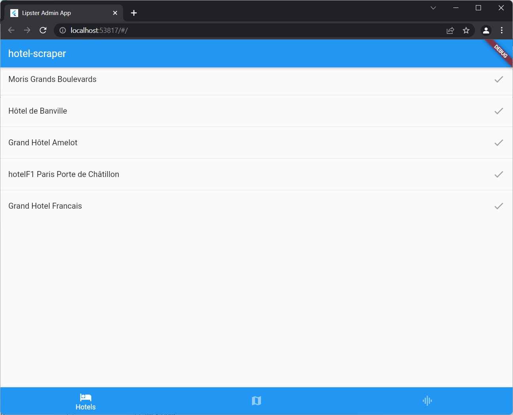
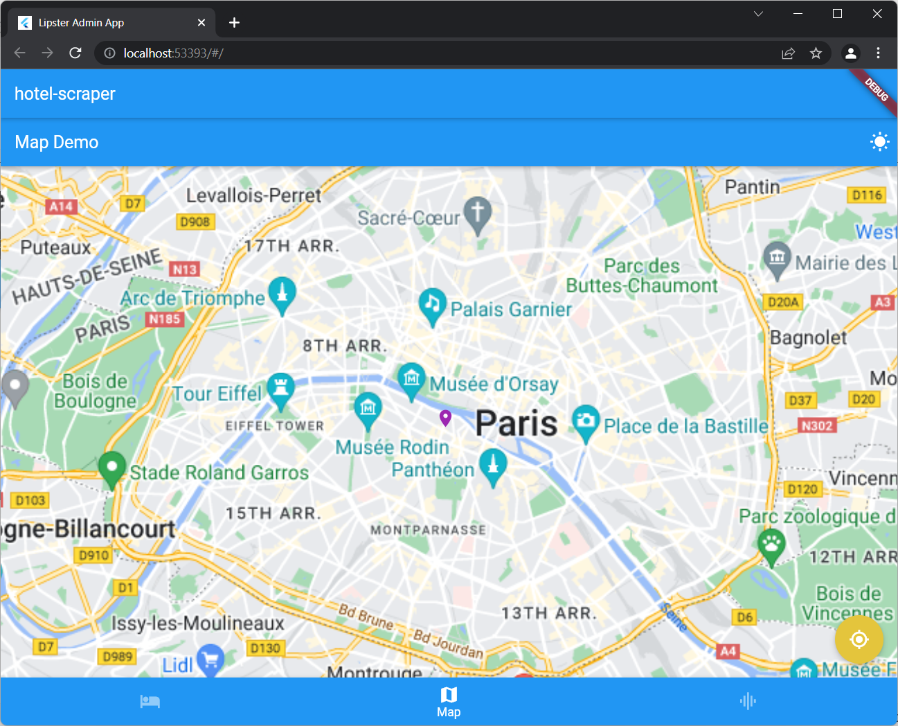

# Hotel-scraper-interface

## Description

Test project for locating and display datas about hotels in Paris according to a specific research.  
The program is made in Flutter, making the app available for all kinds of system :

- Windows
- Linux
- Max
- Android
- iOS

## Functionnalities

- Search hotels.
- Diplay informations about the hotel (price, location, review score rate, etc...).
- Show hotels on map.
- Show graph about the evolution of the prices of hotels each month.

## Images

| Main page | Map page |
| --- | --- |
|  |  |

| Statistics page |
| --- |
|  |
